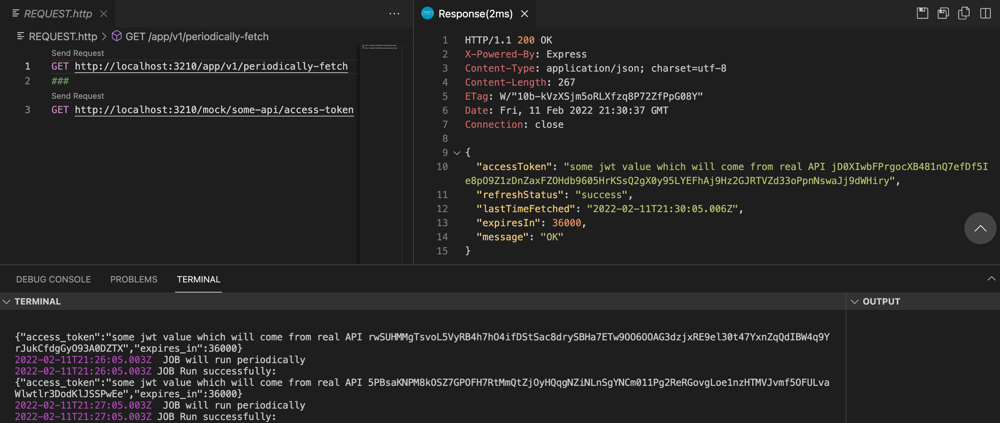

# periodically-fetch

NodeJS based periodically fetch API . The main purpose of this API server is to request any backend services to get access_token preodicaly based on predefined Cron JOB Scheduler . So, that in case of frequest reuest from any testing process we will not hammer the actual server unnecessaryly . This kind of periodically-fetch server can be usefull in many diffrent area .

1. If you need to make hundreds of thousands of reuest to get the access_token from server for Performance testing as your tools or script need that , But you don't want to send those request to ecerytime to actual server.
2. Use as Heartbeat Server . Where many of your microserices need to get the same access_token but insted of requesting from each indivisual node to real server , we can request this server to get the access_token . So, your acctual server will not get overloaded or the access_token quata limit will not cross.

# Note: This is a very basic implementation . So, don't use for production until you tested properly for your application specific requirment!

npm install

nodemon app.js

**Server Endpoint**
http://localhost:3210/app/v1/periodically-fetch

